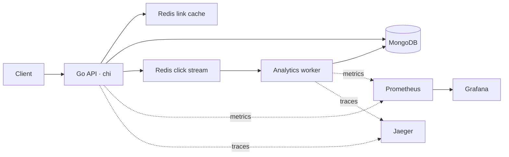

# Shorts

A URL shortener API built with Go, MongoDB, and Redis. Shorts supports generated and custom links, JWT authentication, asynchronous click analytics, and observability through Prometheus, OpenTelemetry, and structured logs.

## Contents

- [Features](#features)
- [Architecture](#architecture)
- [Getting started](#getting-started)
- [API reference](#api-reference)
- [Configuration](#configuration)
- [Observability](#observability)
- [Development](#development)
- [Documentation](#documentation)

## Features

- **Short links:** cryptographically generated seven-character Base62 codes or custom slugs, with optional expiration.
- **Authentication:** password hashing with bcrypt, JWT access and refresh tokens, and authenticated link creation.
- **Fast redirects:** Redis caching, negative caching for missing links, and singleflight coordination for concurrent lookups.
- **Validation:** HTTP/HTTPS target validation and reserved slug protection.
- **Rate limiting:** Redis-backed limits for link creation, slug availability checks, and analytics requests.
- **Click analytics:** Redis Streams ingestion, batch processing, daily click summaries, and browser/referrer breakdowns available to the link owner.
- **Observability:** Prometheus metrics, OTLP tracing for HTTP/Redis/MongoDB, and production JSON logs with trace correlation and value sanitization.

## Architecture



MongoDB stores users, links, raw click events, and daily analytics summaries. Redirects resolve through Redis, falling back to MongoDB on cache misses. Click publication is queued in the API process; the worker processes stream messages and acknowledges them after committing the database transaction.

The API and worker have separate entry points. Docker Compose supplies the database, cache, and observability services; run the Go processes separately.

## Getting started

### Prerequisites

- A Go toolchain compatible with [go.mod](go.mod), which currently declares `go 1.27.1`.
- Docker Engine or Docker Desktop with Docker Compose.
- `curl` for the API examples below.
- MongoDB configured as a replica set or sharded cluster to run the analytics worker.

### 1. Clone and configure

```sh
git clone https://github.com/MohsenDowlati/shorts.git
cd shorts
cp .env.example .env
```

Edit `.env` before starting the API:

- Set `ACCESS_TOKEN_SECRET`, `REFRESH_TOKEN_SECRET`, and `ANALYTICS_IP_SALT` to independent random values of at least 32 characters each. For example, generate each value with `openssl rand -hex 32`.
- Set `DB_USER` and `DB_PASS` to match the MongoDB `MONGO_INITDB_ROOT_USERNAME` and `MONGO_INITDB_ROOT_PASSWORD` in [docker-compose.yml](docker-compose.yml). Keep `DB_AUTH_SOURCE=admin` for that root account.
- Keep `DB_HOST=localhost`, `DB_PORT=27017`, `DB_NAME=shorts`, and `REDIS_ADDR=localhost:6379` when running the API on the host.

Use dedicated credentials for deployments. The Compose file contains local development credentials; changing MongoDB initialization credentials does not update users in an existing database volume.

### 2. Start supporting services

```sh
docker compose up -d db cache jaeger prometheus grafana
```

| Service | Local address | Purpose |
| --- | --- | --- |
| MongoDB | `localhost:27017` | Persistent storage |
| Redis | `localhost:6379` | Cache, rate limits, and click stream |
| Jaeger | `http://localhost:16686` | Trace viewer |
| Prometheus | `http://localhost:9090` | Metrics queries |
| Grafana | `http://localhost:3000` | Dashboards |

Grafana's initial administrator credentials are configured in `docker-compose.yml`.

### 3. Run the API

From the project root:

```sh
go mod download
go run ./cmd
```

The API listens on `http://localhost:8080` by default. In another terminal:

```sh
curl http://localhost:8080/healthz
curl http://localhost:8080/metrics
```

`/healthz` reports HTTP service availability; it does not perform dependency readiness checks.

### 4. Run the analytics worker

The supplied Compose MongoDB service is standalone. Link creation and redirects can use it, but the analytics worker uses multi-document transactions and needs a replica set or sharded cluster.

Configure `MONGODB_URI` in `.env` to point to that deployment and set `DB_NAME` to the same database used by the API. For a local replica set, the URI can have this shape:

```dotenv
MONGODB_URI=mongodb://localhost:27017/shorts?replicaSet=rs0
```

The URI must match your deployment's hostnames, authentication settings, and replica set name. Restart the API after changing its database configuration, then start the worker in a separate terminal:

```sh
go run ./cmd/worker
```

Set a distinct `REDIS_ANALYTICS_CONSUMER_NAME` for each worker instance. Worker metrics are available on port `9091`. See [Analytics worker](docs/analytics-worker.md) for transaction, retry, and retention behavior.

## API reference

Authenticated routes require `Authorization: Bearer <access_token>`.

| Method | Route | Authentication | Description |
| --- | --- | --- | --- |
| POST | `/api/v1/auth/signup` | Public | Create an account and issue tokens |
| POST | `/api/v1/auth/signin` | Public | Sign in and issue tokens |
| POST | `/api/v1/auth/refresh` | Refresh token in body | Issue a new access token |
| GET | `/api/v1/auth/me` | Access token | Get the authenticated user's identity |
| POST | `/api/v1/links` | Access token | Create an automatic or custom link |
| GET | `/api/v1/links/check-slug?slug={slug}` | Public | Check custom slug availability |
| POST | `/api/v1/links/check-slug` | Public | Check availability with a JSON `slug` field |
| GET | `/api/v1/links/{code}/analytics` | Link owner | Query daily analytics |
| GET | `/{code}` | Public | Redirect to the original URL |
| GET | `/healthz` | Public | HTTP health endpoint |
| GET | `/metrics` | Public | Prometheus exposition |

### Register and obtain a token

```sh
curl -X POST http://localhost:8080/api/v1/auth/signup \
  -H 'Content-Type: application/json' \
  -d '{"username":"demo-user","password":"replace-with-a-strong-password"}'
```

Usernames must contain 3–32 characters and passwords at least 8 characters. A successful signup returns `201 Created` with `user`, `access_token`, and `refresh_token`. Sign-in accepts the same JSON fields.

Copy the returned access token into your shell:

```sh
export ACCESS_TOKEN='paste-your-access-token-here'
```

### Create a short link

```sh
curl -X POST http://localhost:8080/api/v1/links \
  -H "Authorization: Bearer $ACCESS_TOKEN" \
  -H 'Content-Type: application/json' \
  -d '{"original_url":"https://example.com","type":"custom","code":"my-link"}'
```

The response is `201 Created` and contains the link fields plus `short_url`.

For automatic generation, send `{"original_url":"https://example.com","type":"auto"}`. Custom codes must contain 3–64 characters using letters, digits, underscores, or hyphens, and must not match a reserved route name. The optional `expires_at` field accepts a future RFC 3339 timestamp.

### Follow a redirect

```sh
curl -i http://localhost:8080/my-link
```

Successful redirects return **307 Temporary Redirect** with a `Location` header. Unknown links return `404`; expired or disabled links return `410`.

### Query analytics

```sh
curl http://localhost:8080/api/v1/links/my-link/analytics \
  -H "Authorization: Bearer $ACCESS_TOKEN"
```

The default range covers the most recent 30 UTC calendar days. Optional `from` and `to` parameters accept inclusive dates in `YYYY-MM-DD` format. Responses contain `total_clicks`, `daily`, `referrers`, and `browsers`. Results are updated asynchronously as the worker processes events.

### Refresh an access token

```sh
curl -X POST http://localhost:8080/api/v1/auth/refresh \
  -H 'Content-Type: application/json' \
  -d '{"refresh_token":"paste-your-refresh-token-here"}'
```

API errors use a JSON body such as `{"error":"link not found"}`. Rate limits return `429 Too Many Requests`; duplicate usernames or custom slugs return `409 Conflict`.

## Configuration

Start with [.env.example](.env.example). Development loads `.env` from the working directory. When `APP_ENV=production` is supplied in the process environment, local `.env` loading is skipped; supply configuration through your runtime environment.

| Variable | Default / requirement | Purpose |
| --- | --- | --- |
| `APP_ENV` | `development` | Environment; `production` selects JSON logs |
| `SERVER_ADDRESS` | `:8080` | API listener |
| `WORKER_METRICS_ADDRESS` | `:9091` | Worker metrics listener |
| `LOG_LEVEL` | `info` | `debug`, `info`, `warn`, or `error` |
| `CONTEXT_TIMEOUT` | `10` | Service operation timeout in seconds |
| `MONGODB_URI` | URI or `DB_*` settings required | MongoDB connection string; takes precedence over `DB_*` connection settings |
| `DB_NAME` | Required; may be derived from URI | Database name |
| `REDIS_ADDR` | `localhost:6379` | Redis address |
| `REDIS_PASSWORD` / `REDIS_DB` | Empty / `0` | Redis credentials and database |
| `ACCESS_TOKEN_SECRET` / `REFRESH_TOKEN_SECRET` | Required; 32+ characters each | JWT signing secrets |
| `ACCESS_TOKEN_EXPIRY_HOUR` / `REFRESH_TOKEN_EXPIRY_HOUR` | `2` / `168` | Token lifetimes in hours |
| `ANALYTICS_IP_SALT` | Required by API; 32+ characters | Salt for hashing analytics client addresses |
| `SHORTENER_DOMAINS` | `localhost` | Comma-separated shortener domains used in URL validation |
| `TRUSTED_PROXY_CIDRS` | Empty | Proxy networks allowed to supply forwarded client addresses |
| `REDIS_ANALYTICS_STREAM` | `stream:clicks` | Click stream name |
| `REDIS_ANALYTICS_CONSUMER_GROUP` | `analytics-workers` | Worker consumer group |
| `REDIS_ANALYTICS_CONSUMER_NAME` | Required by worker | Unique worker identity |
| `ANALYTICS_BATCH_SIZE` | `100` | Maximum events per batch |
| `CLICK_EVENTS_RETENTION_DAYS` | `0` | Raw-event TTL; zero disables expiration |
| `ANALYTICS_MAX_QUERY_DAYS` | `366` | Maximum analytics date range |
| `OTEL_EXPORTER_OTLP_PROTOCOL` | `grpc` | `grpc` or `http/protobuf` |
| `OTEL_EXPORTER_OTLP_ENDPOINT` | Local port `4317` or `4318` | Trace collector endpoint |
| `OTEL_SERVICE_NAME` | Process-specific | Override the trace service name |

Redis pool, timeout, and worker retry settings are listed in `.env.example`. Keep raw-event retention longer than the stream redelivery window to preserve analytics deduplication.

The local Redis service disables persistence. Its cache, rate limit state, and queued click events do not survive a container restart; configure persistence for deployments that require durable click ingestion.

## Observability

### Metrics

The API exposes `/metrics` on port `8080`; the worker exposes it on port `9091`. The Compose Prometheus configuration scrapes both host processes through `host.docker.internal`.

| Metric | Measures |
| --- | --- |
| `shortener_requests_total` | Link creation and redirect requests by type and HTTP status |
| `shortener_redirect_latency_seconds` | Redirect latency with buckets from 100 µs through 2.5 seconds, plus `+Inf` |
| `shortener_cache_hits_total` / `shortener_cache_misses_total` | Link cache lookup outcomes |
| `shortener_stream_lag` | Unread stream entries plus pending acknowledgments, measured at scrape time |
| `shortener_db_operations_total` | MongoDB operations for links and click events |

Metric dimensions exclude dynamic slugs and user IDs. See [Metrics](docs/metrics.md) for label definitions and PromQL queries.

### Tracing

Both processes export traces using OTLP over gRPC or HTTP/protobuf. Link creation and redirect routes extract W3C trace context; Redis and MongoDB operations produce child spans. Queued XADD publication retains the redirect trace context. Worker processing uses separate traces.

Open Jaeger on port `16686` and select `shortener-api` or `shortener-analytics-worker`. See [Tracing](docs/tracing.md) for exporter configuration and trace verification.

### Logging

Production writes JSON records to stdout. Context-aware logs include `trace_id` and `span_id` when a valid span context is present. HTTP access records include status and fractional `duration_ms`; redirect records also include the code and cache outcome. The logging handler sanitizes sensitive values. See [Logging](docs/logging.md) for its behavior and limits.

## Development

```text
cmd/
  main.go             API entry point
  server/             Application wiring and HTTP lifecycle
  worker/             Analytics worker entry point
internal/
  analytics/          Stream ingestion and batch processing
  api/                HTTP routing
  auth/               JWTs, password hashing, and auth middleware
  cache/              Redis link cache
  config/             Environment and dependency initialization
  domain/             Models and slug rules
  handler/http/       API handlers
  logging/            Sanitization and access logging
  metrics/            Prometheus instrumentation
  ratelimit/          Redis rate limits and client address resolution
  repository/         MongoDB persistence
  service/            Link and analytics business logic
  telemetry/          OpenTelemetry setup and instrumentation
  urlguard/           Target URL validation
Docker/               Observability service configuration
docs/                 Operational and verification guides
```

Commands for local verification:

```sh
go test ./...
go test -race ./...
go vet ./...
```

Live acceptance checks for metrics, traces, and logs are documented in [Observability acceptance checks](docs/observability-checks.md).

## Documentation

- [Analytics worker](docs/analytics-worker.md)
- [Prometheus metrics](docs/metrics.md)
- [OpenTelemetry tracing](docs/tracing.md)
- [Structured logging](docs/logging.md)
- [Observability acceptance checks](docs/observability-checks.md)

Issues and pull requests are welcome. Include reproduction steps for bugs and describe the behavior and verification steps for proposed changes.
